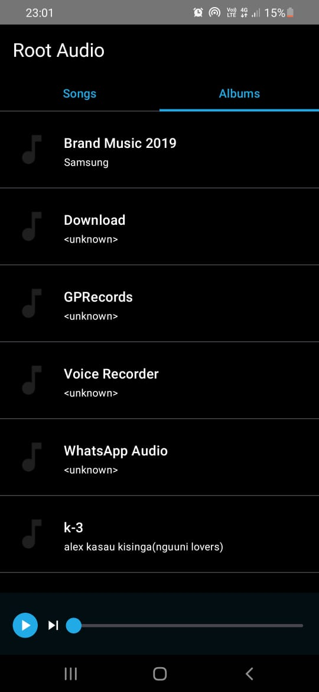
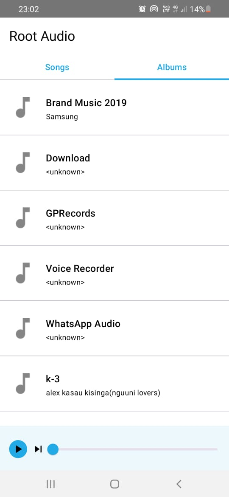
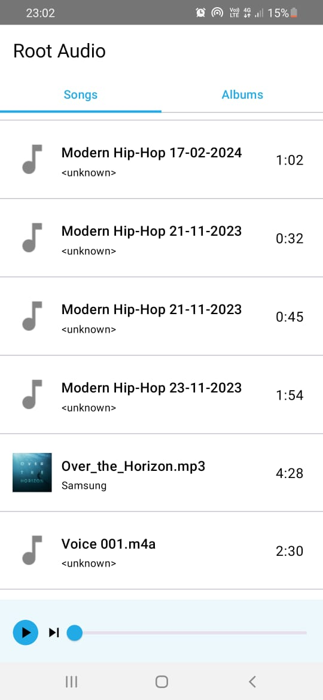

# Root Audio Player App

This is a music player that allows you to play local music files and albums

The App is written using media3, which makes designing music players faster as compared to media2

## Audio app overview 
The preferred architecture for an audio app is a client/server design. The client is an Activity in your app that includes a MediaBrowser, media controller, and the UI. The server is a MediaBrowserService containing the player and a media session.

Audio activity and BrowserService

since we are using media3, I chose to use MediaSessionService which removes a lot of code used in media2

### MediaSessionService
MediaSessionService is an Android class that helps developers build media apps with background playback capabilities and external control features. Here's a breakdown of what it offers:

Background Playback:  MediaSessionService allows your media player to run as a service separate from your app's main activity. This enables playback to continue even when the user minimizes the app or switches to another one.

External Control:  Using MediaSessionService, your app can create a MediaSession which acts as a control interface for external sources like:

Media buttons: The physical media buttons on devices (play/pause, skip) can be used to control playback through the MediaSession.
Notification Controls: A media notification is automatically generated by MediaSessionService. This notification displays playback information and controls that can be used to manage playback.
External Apps: Other apps like Google Assistant or Wear OS companion apps can discover and connect to your media session, allowing them to control playback without needing to interact with your app directly.
In essence, MediaSessionService decouples your media playback from your app's activity, enabling a more flexible and user-friendly experience.

I then used MVVM to expose the state to my UI through the ViewModel. 

# MVVM Architecture

MVVM (Model-View-ViewModel) is a software architectural pattern that facilitates separation of concerns and supports a more modular, maintainable, and testable codebase. It's commonly used in Android development, although it's applicable to other platforms as well.

## Components of MVVM:

### Model:
- Represents the data and business logic of the application.
- It encapsulates the data model and domain-specific logic.
- Examples include data classes, repositories, network clients, database access, etc.

### View:
- Represents the UI components and layout of the application.
- It is responsible for rendering the UI and responding to user interactions.
- Examples include activities, fragments, custom views, XML layout files, etc.

### ViewModel:
- Acts as an intermediary between the Model and the View.
- It exposes data and behavior to the View, abstracting away the underlying business logic.
- It survives configuration changes (e.g., screen rotation) and holds the UI-related data.
- It's typically a lifecycle-aware component and often implemented as a LiveData or StateFlow.
- Examples include ViewModel classes, LiveData or StateFlow objects, etc.

## Key Principles of MVVM:

### Separation of Concerns:
- MVVM promotes the separation of concerns by clearly defining the responsibilities of each component.
- Models encapsulate data and business logic, Views handle UI rendering, and ViewModels manage the interaction between them.

### Testability:
- MVVM enhances the testability of the application by decoupling the UI logic from the business logic.
- ViewModels can be unit tested independently of the View, making it easier to write automated tests.

### Data Binding:
- MVVM leverages data binding to establish a two-way communication between the View and the ViewModel.
- It allows for automatic synchronization of UI components with the ViewModel data, reducing boilerplate code.

## Advantages of MVVM:

1. **Modularity**: MVVM promotes modular design, making it easier to maintain and extend the application.
2. **Testability**: Separation of concerns and dependency injection facilitate unit testing of components.
3. **Reusability**: ViewModels can be reused across multiple Views, promoting code reusability.
4. **Scalability**: MVVM scales well with large codebases, allowing teams to work on different parts of the application independently.

## How to Implement MVVM in Android:

1. Define your data models and repositories to encapsulate data access and manipulation.
2. Create ViewModels to expose data and behavior to your UI components.
3. Implement LiveData or StateFlow to handle observable data changes in your ViewModels.
4. Bind UI components to ViewModel data using data binding or other techniques.
5. Write unit tests for your ViewModels to verify their behavior.

## Screenshots

 

 

 